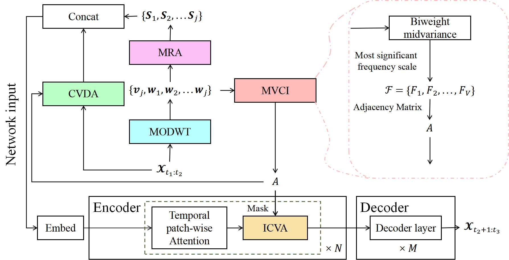

# Inconsistent Multivariate Time Series Forecasting


This is the origin Pytorch implementation of FPPformer-MD in the following paper: 
[Inconsistent Multivariate Time Series Forecasting] (Manuscript submitted to IEEE Transactions on Knowledge and Data Engineering).

## Model Architecture
This work intends to solve two general problems involved in deep MTSF. (1) The existing approaches for addressing variable correlations, including CD and CI approaches, consistently ignore or extract all possible variable correlations, making them either insufficient or inappropriate. (2) The existing data augmentation methods hardly exploit variable correlations to generate more training instances. Moreover, since we mainly combine the proposed inconsistent MTSF approach with the FPPformer, this work also attempts to compensate for the inadequacy of the input features in the embedding layer of the FPPformer. To address these problems, we propose an MVCI method that dynamically identifies local variable correlations and an ICVA module that adaptively extracts the cross-variable features of the correlated variables, thus solving general problem (1). Moreover, the MODWT smooths produced by MVCI can additionally provide interpretable input features to enrich the input of the FPPformer. Then, the unique problem of the FPPformer is solved. We also propose a CVDA method to generate more training instances by conducting DMD on the multivariate input sequences, hence addressing general problem (2). As shown in Fig. 1, five major steps are required to upgrade the FPPformer to our proposed FPPformer-MD model:
<p align="center">

<br><br>
<b>Figure 1.</b> The architecture of FPPformer-MD with a $N$-stage encoder and a $M$-stage decoder  ($N=M=6$ in experiment). The colored modules are the novel methods proposed in this work.
</p>

|  |
|:---:-----|:---:-----|:---:-----|:---:-----|:---:-----|:---:-----|:---:-----|:---:-----|:---:-----|:---:-----|:---:-----|:---:-----|:---:-----|:---:-----|:---:-----|:---:-----|:---:-----|:---:-----|
| {*}{Methods} |  |
| {*}{Metrics} |  |
| {c|}{ETTh} |  |
| {c|}{ETTm} |  |
| {c|}{ECL} |  |
| {c}{Traffic} |
| (lr){3-6} |
| (lr){7-10} |
| (lr){11-14} |
| (lr){15-18} |
|  |  |
|  |  |
| 192 |  |
| 336 |  |
| 720 |  |
| Avg. |  |
| 192 |  |
| 336 |  |
| 720 |  |
| Avg. |  |
| 192 |  |
| 336 |  |
| 720 |  |
| Avg. |  |
| 192 |  |
| 336 |  |
| 720 |  |
| Avg. |
|  |
| {*}{FPPformer-MD} |  |
| MSE |  |
| } |  |
| } |  |
| } |  |
| } |  |
| } |  |
| } |  |
| } |  |
| } |  |
| } |  |
| } |  |
| } |  |
| } |  |
| } |  |
| } |  |
| } |  |
| } |
|  |  |
| MAE |  |
| } |  |
| } |  |
| } |  |
| } |  |
| } |  |
| } |  |
| } |  |
| } |  |
| } |  |
| } |  |
| } |  |
| } |  |
| } |  |
| } |  |
| } |  |
| } |
| {*}{FPPformer} |  |
| MSE |  |
| } |  |
| } |  |
| 0.451 |  |
| } |  |
| } |  |
| } |  |
| } |  |
| } |  |
| 0.186 |  |
| 0.203 |  |
| 0.246 |  |
| 0.212 |  |
| 0.479 |  |
| 0.486 |  |
| } |  |
| 0.495 |
|  |  |
| MAE |  |
| } |  |
| } |  |
| } |  |
| } |  |
| } |  |
| } |  |
| } |  |
| } |  |
| } |  |
| } |  |
| 0.317 |  |
| } |  |
| } |  |
| } |  |
| } |  |
| } |
| {*}{ARM} |  |
| MSE |  |
| 0.599 |  |
| 0.701 |  |
| 0.787 |  |
| 0.696 |  |
| 0.466 |  |
| 0.693 |  |
| 0.897 |  |
| 0.685 |  |
| 0.179 |  |
| 0.208 |  |
| 0.256 |  |
| 0.215 |  |
| 0.951 |  |
| 0.983 |  |
| 1.154 |  |
| 1.029 |
|  |  |
| MAE |  |
| 0.520 |  |
| 0.583 |  |
| 0.628 |  |
| 0.577 |  |
| 0.441 |  |
| 0.540 |  |
| 0.632 |  |
| 0.537 |  |
| 0.285 |  |
| 0.307 |  |
| 0.343 |  |
| 0.312 |  |
| 0.419 |  |
| 0.410 |  |
| 0.436 |  |
| 0.422 |
| {*}{iTransformer} |  |
| MSE |  |
| 0.413 |  |
| 0.466 |  |
| 0.493 |  |
| 0.457 |  |
| 0.327 |  |
| 0.373 |  |
| 0.467 |  |
| 0.389 |  |
| 0.176 |  |
| 0.194 |  |
| 0.233 |  |
| 0.201 |  |
| } |  |
| } |  |
| 0.523 |  |
| } |
|  |  |
| MAE |  |
| 0.420 |  |
| 0.451 |  |
| 0.481 |  |
| 0.451 |  |
| 0.359 |  |
| 0.388 |  |
| 0.438 |  |
| 0.395 |  |
| 0.265 |  |
| 0.284 |  |
| 0.317 |  |
| 0.289 |  |
| 0.316 |  |
| 0.326 |  |
| 0.350 |  |
| 0.331 |
| {*}{ModernTCN} |  |
| MSE |  |
| 0.423 |  |
| 0.449 |  |
| 0.474 |  |
| 0.449 |  |
| 0.371 |  |
| 0.433 |  |
| 0.542 |  |
| 0.449 |  |
| 0.183 |  |
| 0.194 |  |
| } |  |
| 0.200 |  |
| 0.527 |  |
| 0.541 |  |
| 0.573 |  |
| 0.547 |
|  |  |
| MAE |  |
| 0.419 |  |
| 0.437 |  |
| 0.462 |  |
| 0.439 |  |
| 0.387 |  |
| 0.425 |  |
| 0.483 |  |
| 0.432 |  |
| 0.284 |  |
| 0.297 |  |
| 0.320 |  |
| 0.300 |  |
| 0.365 |  |
| 0.369 |  |
| 0.381 |  |
| 0.372 |
| {*}{LIFT} |  |
| MSE |  |
| 0.463 |  |
| 0.532 |  |
| 0.544 |  |
| 0.513 |  |
| 0.337 |  |
| 0.453 |  |
| 0.501 |  |
| 0.430 |  |
| } |  |
| } |  |
| } |  |
| } |  |
| 0.516 |  |
| 0.529 |  |
| 0.574 |  |
| 0.540 |
|  |  |
| MAE |  |
| 0.444 |  |
| 0.482 |  |
| 0.504 |  |
| 0.477 |  |
| 0.368 |  |
| 0.415 |  |
| 0.461 |  |
| 0.414 |  |
| } |  |
| 0.287 |  |
| } |  |
| 0.289 |  |
| 0.313 |  |
| 0.308 |  |
| 0.324 |  |
| 0.315 |
| {*}{FITS} |  |
| MSE |  |
| 0.409 |  |
| 0.449 |  |
| } |  |
| 0.434 |  |
| 0.320 |  |
| 0.369 |  |
| 0.449 |  |
| 0.379 |  |
| 0.213 |  |
| 0.227 |  |
| 0.267 |  |
| 0.236 |  |
| 0.618 |  |
| 0.625 |  |
| 0.661 |  |
| 0.635 |
|  |  |
| MAE |  |
| 0.410 |  |
| 0.438 |  |
| 0.453 |  |
| 0.434 |  |
| 0.350 |  |
| 0.381 |  |
| 0.424 |  |
| 0.385 |  |
| 0.300 |  |
| 0.314 |  |
| 0.344 |  |
| 0.319 |  |
| 0.386 |  |
| 0.385 |  |
| 0.401 |  |
| 0.391 |
| {*}{SAMformer} |  |
| MSE |  |
| 0.414 |  |
| 0.458 |  |
| 0.474 |  |
| 0.449 |  |
| 0.316 |  |
| 0.367 |  |
| 0.446 |  |
| 0.376 |  |
| 0.188 |  |
| 0.205 |  |
| 0.249 |  |
| 0.214 |  |
| 0.527 |  |
| 0.540 |  |
| 0.576 |  |
| 0.548 |
|  |  |
| MAE |  |
| 0.415 |  |
| 0.445 |  |
| 0.469 |  |
| 0.443 |  |
| 0.349 |  |
| 0.382 |  |
| 0.426 |  |
| 0.386 |  |
| 0.273 |  |
| 0.290 |  |
| 0.324 |  |
| 0.296 |  |
| 0.349 |  |
| 0.352 |  |
| 0.371 |  |
| 0.357 |
| {*}{SparseTSF} |  |
| MSE |  |
| 0.416 |  |
| 0.452 |  |
| 0.458 |  |
| 0.442 |  |
| 0.336 |  |
| 0.380 |  |
| 0.457 |  |
| 0.391 |  |
| 0.206 |  |
| 0.219 |  |
| 0.261 |  |
| 0.229 |  |
| 0.611 |  |
| 0.618 |  |
| 0.655 |  |
| 0.628 |
|  |  |
| MAE |  |
| 0.412 |  |
| 0.436 |  |
| 0.458 |  |
| 0.435 |  |
| 0.359 |  |
| 0.386 |  |
| 0.428 |  |
| 0.391 |  |
| 0.282 |  |
| 0.295 |  |
| 0.330 |  |
| 0.302 |  |
| 0.370 |  |
| 0.370 |  |
| 0.391 |  |
| 0.377 |
|  |
| {*}{Methods} |  |
| {*}{Metrics} |  |
| {c|}{Weather} |  |
| {c|}{Solar} |  |
| {c|}{PeMS} |  |
| {c}{PeMS-Bay} |
| (lr){3-6} |
| (lr){7-10} |
| (lr){11-14} |
| (lr){15-18} |
|  |  |
|  |  |
| 192 |  |
| 336 |  |
| 720 |  |
| Avg. |  |
| 192 |  |
| 336 |  |
| 720 |  |
| Avg. |  |
| 192 |  |
| 336 |  |
| 720 |  |
| Avg. |  |
| 192 |  |
| 336 |  |
| 720 |  |
| Avg. |
|  |
| {*}{FPPformer-MD} |  |
| MSE |  |
| } |  |
| } |  |
| } |  |
| } |  |
| } |  |
| } |  |
| } |  |
| } |  |
| } |  |
| } |  |
| } |  |
| } |  |
| } |  |
| } |  |
| } |  |
| } |
|  |  |
| MAE |  |
| } |  |
| } |  |
| } |  |
| } |  |
| } |  |
| } |  |
| } |  |
| } |  |
| } |  |
| } |  |
| } |  |
| } |  |
| } |  |
| } |  |
| } |  |
| } |
| {*}{FPPformer} |  |
| MSE |  |
| 0.219 |  |
| } |  |
| } |  |
| } |  |
| 0.263 |  |
| 0.270 |  |
| 0.273 |  |
| 0.269 |  |
| 0.534 |  |
| 0.438 |  |
| 0.519 |  |
| 0.497 |  |
| 1.068 |  |
| 0.959 |  |
| 1.081 |  |
| 1.036 |
|  |  |
| MAE |  |
| } |  |
| } |  |
| } |  |
| } |  |
| 0.276 |  |
| } |  |
| } |  |
| } |  |
| 0.510 |  |
| 0.446 |  |
| 0.498 |  |
| 0.485 |  |
| 0.530 |  |
| 0.488 |  |
| 0.533 |  |
| 0.517 |
| {*}{ARM} |  |
| MSE |  |
| 0.243 |  |
| 0.289 |  |
| 0.355 |  |
| 0.296 |  |
| 0.293 |  |
| 0.303 |  |
| 0.308 |  |
| 0.301 |  |
| 0.315 |  |
| 0.307 |  |
| 0.367 |  |
| 0.330 |  |
| 0.964 |  |
| 0.891 |  |
| 1.041 |  |
| 0.965 |
|  |  |
| MAE |  |
| 0.298 |  |
| 0.327 |  |
| 0.370 |  |
| 0.332 |  |
| 0.323 |  |
| 0.324 |  |
| 0.329 |  |
| 0.325 |  |
| 0.393 |  |
| 0.382 |  |
| 0.415 |  |
| 0.397 |  |
| 0.523 |  |
| 0.500 |  |
| 0.550 |  |
| 0.524 |
| {*}{iTransformer} |  |
| MSE |  |
| 0.228 |  |
| 0.282 |  |
| 0.358 |  |
| 0.289 |  |
| } |  |
| } |  |
| } |  |
| } |  |
| 0.353 |  |
| 0.316 |  |
| 0.388 |  |
| 0.352 |  |
| 0.950 |  |
| 0.870 |  |
| 0.954 |  |
| 0.925 |
|  |  |
| MAE |  |
| 0.262 |  |
| 0.300 |  |
| 0.350 |  |
| 0.304 |  |
| } |  |
| 0.281 |  |
| 0.285 |  |
| 0.279 |  |
| 0.417 |  |
| 0.382 |  |
| 0.434 |  |
| 0.411 |  |
| 0.498 |  |
| } |  |
| 0.502 |  |
| } |
| {*}{ModernTCN} |  |
| MSE |  |
| } |  |
| 0.278 |  |
| 0.368 |  |
| 0.287 |  |
| 0.251 |  |
| 0.263 |  |
| 0.276 |  |
| 0.263 |  |
| } |  |
| } |  |
| } |  |
| } |  |
| 0.910 |  |
| 0.867 |  |
| } |  |
| 0.906 |
|  |  |
| MAE |  |
| 0.257 |  |
| 0.302 |  |
| 0.359 |  |
| 0.306 |  |
| 0.286 |  |
| 0.290 |  |
| 0.292 |  |
| 0.289 |  |
| } |  |
| } |  |
| } |  |
| } |  |
| } |  |
| 0.476 |  |
| } |  |
| } |
| {*}{LIFT} |  |
| MSE |  |
| 0.223 |  |
| } |  |
| 0.412 |  |
| 0.303 |  |
| 0.285 |  |
| 0.296 |  |
| 0.294 |  |
| 0.292 |  |
| 0.261 |  |
| 0.260 |  |
| 0.294 |  |
| 0.271 |  |
| } |  |
| } |  |
| 0.952 |  |
| } |
|  |  |
| MAE |  |
| 0.272 |  |
| 0.307 |  |
| 0.390 |  |
| 0.323 |  |
| 0.331 |  |
| 0.329 |  |
| 0.327 |  |
| 0.329 |  |
| 0.351 |  |
| 0.344 |  |
| 0.371 |  |
| 0.355 |  |
| 0.526 |  |
| 0.504 |  |
| 0.543 |  |
| 0.524 |
| {*}{FITS} |  |
| MSE |  |
| 0.242 |  |
| 0.293 |  |
| 0.366 |  |
| 0.300 |  |
| 0.382 |  |
| 0.421 |  |
| 0.422 |  |
| 0.408 |  |
| 1.183 |  |
| 0.877 |  |
| 1.020 |  |
| 1.027 |  |
| 1.342 |  |
| 1.152 |  |
| 1.308 |  |
| 1.267 |
|  |  |
| MAE |  |
| 0.273 |  |
| 0.308 |  |
| 0.355 |  |
| 0.312 |  |
| 0.394 |  |
| 0.410 |  |
| 0.403 |  |
| 0.402 |  |
| 0.834 |  |
| 0.675 |  |
| 0.751 |  |
| 0.753 |  |
| 0.665 |  |
| 0.585 |  |
| 0.650 |  |
| 0.633 |
| {*}{SAMformer} |  |
| MSE |  |
| 0.230 |  |
| 0.283 |  |
| 0.356 |  |
| 0.290 |  |
| 0.282 |  |
| 0.312 |  |
| 0.321 |  |
| 0.305 |  |
| 0.637 |  |
| 0.514 |  |
| 0.592 |  |
| 0.581 |  |
| 1.161 |  |
| 1.031 |  |
| 1.174 |  |
| 1.122 |
|  |  |
| MAE |  |
| 0.264 |  |
| 0.301 |  |
| 0.348 |  |
| 0.304 |  |
| 0.321 |  |
| 0.339 |  |
| 0.341 |  |
| 0.334 |  |
| 0.574 |  |
| 0.494 |  |
| 0.549 |  |
| 0.539 |  |
| 0.574 |  |
| 0.522 |  |
| 0.574 |  |
| 0.557 |
| {*}{SparseTSF} |  |
| MSE |  |
| 0.253 |  |
| 0.304 |  |
| 0.372 |  |
| 0.310 |  |
| 0.542 |  |
| 0.556 |  |
| 0.528 |  |
| 0.542 |  |
| 1.453 |  |
| 1.046 |  |
| 1.202 |  |
| 1.233 |  |
| 1.588 |  |
| 1.334 |  |
| 1.482 |  |
| 1.468 |
|  |  |
| MAE |  |
| 0.286 |  |
| 0.318 |  |
| 0.361 |  |
| 0.322 |  |
| 0.461 |  |
| 0.460 |  |
| 0.434 |  |
| 0.452 |  |
| 0.959 |  |
| 0.749 |  |
| 0.826 |  |
| 0.845 |  |
| 0.780 |  |
| 0.673 |  |
| 0.730 |  |
| 0.728 |
|  |

## Requirements
- python == 3.11.4
- numpy == 1.24.3
- pandas == 1.5.3
- scipy == 1.11.3
- torch == 2.1.0+cu118
- scikit-learn == 1.3.0
- PyWavelets == 1.4.1
- astropy == 6.1
- h5py == 3.7.0
- geomstat == 2.5.0

Dependencies can be installed using the following command:
```bash
pip install -r requirements.txt
```

## Data

ETT, ECL, Traffic and Weather dataset were acquired at: [here](https://drive.google.com/drive/folders/1ZOYpTUa82_jCcxIdTmyr0LXQfvaM9vIy?usp=sharing). Solar dataset was acquired at: [Solar](https://drive.google.com/drive/folders/1Gv1MXjLo5bLGep4bsqDyaNMI2oQC9GH2?usp=sharing). PeMSD3, PeMSD4, PeMSD7 and PeMSD8 were acquired at: [PeMS](https://github.com/guoshnBJTU/ASTGNN/tree/main/data). PeMS-Bay was acquired at: [PeMS-Bay](https://drive.google.com/drive/folders/10FOTa6HXPqX8Pf5WRoRwcFnW9BrNZEIX).

### Data Preparation
After you acquire raw data of all datasets, please separately place them in corresponding folders at `./data`. 

We place ETT in the folder `./ETT-data`, ECL in the folder `./electricity`  and weather in the folder `./weather` of [here](https://drive.google.com/drive/folders/1ZOYpTUa82_jCcxIdTmyr0LXQfvaM9vIy?usp=sharing) (the folder tree in the link is shown as below) into folder `./data` and rename them from `./ETT-data`,`./electricity`, `./traffic` and `./weather` to `./ETT`, `./ECL`, `./Traffic` and`./weather` respectively. We rename the file of ECL/Traffic from `electricity.csv`/`traffic.csv` to `ECL.csv`/`Traffic.csv` and rename its last variable from `OT`/`OT` to original `MT_321`/`Sensor_861` separately.
```
The folder tree in https://drive.google.com/drive/folders/1ZOYpTUa82_jCcxIdTmyr0LXQfvaM9vIy?usp=sharing:
|-autoformer
| |-ETT-data
| | |-ETTh1.csv
| | |-ETTh2.csv
| | |-ETTm1.csv
| | |-ETTm2.csv
| |
| |-electricity
| | |-electricity.csv
| |
| |-traffic
| | |-traffic.csv
| |
| |-weather
| | |-weather.csv
```

We place Solar in the folder `./financial` of [Solar](https://drive.google.com/drive/folders/1Gv1MXjLo5bLGep4bsqDyaNMI2oQC9GH2?usp=sharing) (the folder tree in the link is shown as below) into the folder `./data` and rename them as `./Solar` respectively. 

```
The folder tree in https://drive.google.com/drive/folders/1Gv1MXjLo5bLGep4bsqDyaNMI2oQC9GH2?usp=sharing:
|-dataset
| |-financial
| | |-solar_AL.txt
```

We place the NPZ files ('PEMS03.npz', 'PEMS04.npz', 'PEMS07.npz', 'PEMS08.npz') of PeMSD3, PeMSD4, PeMSD7 and PeMSD8 in the folder `./PEMS03`, `./PEMS03`, `./PEMS03` and `./PEMS03` of [PeMS](https://github.com/guoshnBJTU/ASTGNN/tree/main/data) 
 into the folder `./data/PEMS`. We place the H5 file ('pems-bay.h5') of PeMS-Bay in the [PeMS-Bay](https://drive.google.com/drive/folders/10FOTa6HXPqX8Pf5WRoRwcFnW9BrNZEIX) into the folder `./data/PEMS`. The folder trees in the mentioned two links are shown as below:

```
The folder tree in https://github.com/guoshnBJTU/ASTGNN/tree/main/data:
|-PEMS03
| |-PEMS03.csv
| |-PEMS03.npz
| |-PEMS03.txt
|-PEMS04
| |-PEMS04.csv
| |-PEMS04.npz
| |-PEMS04.txt
|-PEMS07
| |-PEMS07.csv
| |-PEMS07.npz
| |-PEMS07.txt
|-PEMS08
| |-PEMS08.csv
| |-PEMS08.npz
| |-PEMS08.txt

The folder tree in https://drive.google.com/drive/folders/10FOTa6HXPqX8Pf5WRoRwcFnW9BrNZEIX:
|-metr-la.h5
|-pems-bay.h5
```

After you process all the datasets, you will obtain folder tree:
```
|-data
| |-ECL
| | |-ECL.csv
| |
| |-ETT
| | |-ETTh1.csv
| | |-ETTh2.csv
| | |-ETTm1.csv
| | |-ETTm2.csv
| |
| |-PEMS
| | |-PEMS03.npz
| | |-PEMS04.npz
| | |-PEMS07.npz
| | |-PEMS08.npz
| | |-pems-bay.h5
| |
| |-Solar
| | |-solar_AL.txt
| |
| |-Traffic
| | |-Traffic.csv
| |
| |-weather
| | |-weather.csv

```

## Baseline
We select eight up-to-date baselines, including three TSFT (ARM, iTransformer, Basisformer), two TSFM(TSMixer, FreTS), one TCN (ModernTCN), one RNN-based forecasting method (WITRAN) and one cutting-edge statistics-based forecasting method (OneShotSTL).  Most of these baselines are relative latecomers to FPPformer and their state-of-the-art performances are competent in challenging or even surpassing it. Their source codes origins are given below:


| Baseline | Source Code |
|:---:|:---:|
| ARM | [https://openreview.net/forum?id=JWpwDdVbaM](https://openreview.net/forum?id=JWpwDdVbaM) |
| iTransformer | [https://github.com/thuml/iTransformer](https://github.com/thuml/iTransformer) |
| Basisformer | [https://github.com/nzl5116190/Basisformer](https://github.com/nzl5116190/Basisformer) |
| TSMixer | [https://github.com/google-research/google-research/tree/master/tsmixer](https://github.com/google-research/google-research/tree/master/tsmixer) |
| FreTS | [https://github.com/aikunyi/frets](https://github.com/aikunyi/frets) |
| ModernTCN |  |
| WITRAN | [https://github.com/Water2sea/WITRAN](https://github.com/Water2sea/WITRAN) |
| OneShotSTL | [https://github.com/xiao-he/oneshotstl](https://github.com/xiao-he/oneshotstl) |


Moreover, the default experiment settings/parameters of aforementioned seven baselines are given below respectively:

<table>
<tr>
<th>Baselines</th>
<th>Settings/Parameters name</th>
<th>Descriptions</th>
<th>Default mechanisms/values</th>
</tr>
<tr>
<th rowspan=8>ARM</th>
<th>d_model</th>
<th>The number of hidden dimensions</th>
<th>64</th>
</tr>
<tr>
<th>n_heads</th>
<th>The number of heads in multi-head attention mechanism</th>
<th>8</th>
</tr>
<tr>
<th>e_layers</th>
<th>The number of encoder layers</th>
<th>2</th>
</tr>
<tr>
<th>d_layers</th>
<th>The number of decoder layers</th>
<th>1</th>
</tr>
<tr>
<th>preprocessing_method</th>
<th>The preprocessing method</th>
<th>AUEL</th>
</tr>
<tr>
<th>conv_size</th>
<th>The kernel size of conv layer</th>
<th>[49, 145, 385]</th>
</tr>
<tr>
<th>conv_padding</th>
<th>Padding</th>
<th>[24, 72, 192]</th>
</tr>
<tr>
<th>ema_alpha</th>
<th>The trainable EMA parameter</th>
<th>0.9</th>
</tr>
<tr>
<th rowspan=4>iTransformer</th>
<th>d_model</th>
<th>The number of hidden dimensions</th>
<th>512</th>
</tr>
<tr>
<th>d_ff</th>
<th>Dimension of fcn</th>
<th>512</th>
</tr>
<tr>
<th>n_heads</th>
<th>The number of heads in multi-head attention mechanism</th>
<th>8</th>
</tr>
<tr>
<th>e_layers</th>
<th>The number of encoder layers</th>
<th>3</th>
</tr>
<tr>
<th rowspan=6>Basisformer</th>
<th>N</th>
<th>The number of learnable basis</th>
<th>10</th>
</tr>
<tr>
<th>block_nums</th>
<th>The number of blocks</th>
<th>2</th>
</tr>
<tr>
<th>bottleneck</th>
<th>reduction of bottleneck</th>
<th>2</th>
</tr>
<tr>
<th>map_bottleneck</th>
<th>reduction of mapping bottleneck</th>
<th>2</th>
</tr>
<tr>
<th>n_heads</th>
<th>The number of heads in multi-head attention mechanism</th>
<th>16</th>
</tr>
<tr>
<th>d_model</th>
<th>The number of hidden dimensions</th>
<th>100</th>
</tr>
<tr>
<th rowspan=2>TSMixer</th>
<th>n_block</th>
<th>The number of block for deep architecture</th>
<th>2</th>
</tr>
<tr>
<th>d_model</th>
<th>The hidden feature dimension</th>
<th>64</th>
</tr>
<tr>
<th rowspan=3>FreTS</th>
<th>embed_size</th>
<th>The number of embedding dimensions</th>
<th>128</th>
</tr>
<tr>
<th>hidden_size</th>
<th>The number of hidden dimensions</th>
<th>256</th>
</tr>
<tr>
<th>channel_independence</th>
<th>Whether channels are dependent</th>
<th>1</th>
</tr>
<tr>
<th rowspan=6>ModernTCN</th>
<th>kernel_size</th>
<th>The number of hidden dimensions</th>
<th>512</th>
</tr>
<tr>
<th>d_ff</th>
<th>Dimension of fcn</th>
<th>2048</th>
</tr>
<tr>
<th>n_heads</th>
<th>The number of heads in multi-head attention mechanism</th>
<th>8</th>
</tr>
<tr>
<th>e_layers</th>
<th>The number of encoder layers</th>
<th>2</th>
</tr>
<tr>
<th>d_layers</th>
<th>The number of decoder layers</th>
<th>1</th>
</tr>
<tr>
<th>modes1</th>
<th>The number of Fourier modes to multiply</th>
<th>32</th>
</tr>
</table>


## Usage
Commands for training and testing FPPformer of all datasets are in `./scripts/Main.sh`.

More parameter information please refer to `main.py`.

We provide a complete command for training and testing FPPformer:

For multivariate forecasting:
```
python -u main.py --data <data> --features <features> --input_len <input_len> --pred_len <pred_len> --encoder_layer <encoder_layer> --patch_size <patch_size> --d_model <d_model> --learning_rate <learning_rate> --dropout <dropout> --batch_size <batch_size> --train_epochs <train_epochs> --patience <patience> --itr <itr> --train
```
For univariate forecasting:
```
python -u main_M4.py --data <data> --freq <freq> --input_len <input_len> --pred_len <pred_len> --encoder_layer <encoder_layer> --patch_size <patch_size> --d_model <d_model> --learning_rate <learning_rate> --dropout <dropout> --batch_size <batch_size> --train_epochs <train_epochs> --patience <patience> --itr <itr> --train
```

Here we provide a more detailed and complete command description for training and testing the model:

| Parameter name |                                          Description of parameter                                          |
|:--------------:|:----------------------------------------------------------------------------------------------------------:|
|      data      |                                              The dataset name                                              |
|   root_path    |                                       The root path of the data file                                       |
|   data_path    |                                             The data file name                                             |
|    features    | The forecasting task. This can be set to `M`,`S` (M : multivariate forecasting, S : univariate forecasting |
|     target     |                                         Target feature in `S` task                                         |
|      freq      |                                   Sampling frequency for M4 sub-datasets                                   |
|  checkpoints   |                                       Location of model checkpoints                                        |
|   input_len    |                                           Input sequence length                                            |
|    pred_len    |                                         Prediction sequence length                                         |
|     enc_in     |                                                 Input size                                                 |
|    dec_out     |                                                Output size                                                 |
|    d_model     |                                             Dimension of model                                             |
| representation |                      Representation dims in the end of the intra-reconstruction phase                      |
|    dropout     |                                                  Dropout                                                   |
| encoder_layer  |                                        The number of encoder layers                                        |
|   patch_size   |                                           The size of each patch                                           |
|      itr       |                                             Experiments times                                              |
|  train_epochs  |                                      Train epochs of the second stage                                      |
|   batch_size   |                         The batch size of training input data in the second stage                          |
|    patience    |                                          Early stopping patience                                           |
| learning_rate  |                                          Optimizer learning rate                                           |


## Results
The experiment parameters of each data set are formated in the `Main.sh` files in the directory `./scripts/`. You can refer to these parameters for experiments, and you can also adjust the parameters to obtain better mse and mae results or draw better prediction figures. We provide the commands for obtain the results of FPPformer with longer input sequence lengths in the file `./scripts/LongInput.sh` and those of FPPformer with different encoder layers  in the file `./scripts/ParaSen.sh`. 

<p align="center">

<br><br>
<b>Figure 2.</b> Multivariate forecasting results
</p>

<p align="center">

<br><br>
<b>Figure 3.</b> Univariate forecasting results
</p>

### Full results
Moreover, we present the full results of multivariate forecasting results with long input sequence lengths in Figure 4, that of ablation study in Figure 5 and that of parameter sensitivity in Figure 6.
<p align="center">

<br><br>
<b>Figure 4.</b> Multivariate forecasting results with long input lengths
</p>
<p align="center">

<br><br>
<b>Figure 5.</b> Ablation results with the prediction length of 720
</p>
<p align="center">

<br><br>
<b>Figure 6.</b> Results of parameter sensitivity on stage numbers
</p>

## Contact
If you have any questions, feel free to contact Li Shen through Email (shenli@buaa.edu.cn) or Github issues. Pull requests are highly welcomed!
